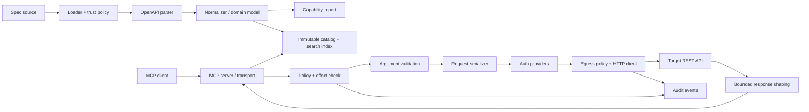

# lotsman — спецификация проекта

Динамический security-first MCP runtime из OpenAPI на Go.

Версия документа: **1.1.4**
Дата: **11 сентября 2026 года**
Статус: proposal после архитектурного ревью версии 1.0 (правки — см. changelog в конце)
Имя проекта: **lotsman** («лоцман» — морской проводник, который поднимается на борт и безопасно ведёт судно в порт). Проверено 31.08.2026: GitHub, пакетные реестры и софтверные товарные знаки чисты; одноимённые компании существуют только в морской отрасли.

---

## 1. Видение

### 1.1 Идея в одном абзаце

`lotsman` — один переносимый Go-бинарник, который загружает OpenAPI-спецификацию без генерации кода, нормализует её в строгую внутреннюю модель и публикует поддерживаемые операции как MCP tools. Перед исполнением движок валидирует аргументы, применяет server-side policy, безопасно собирает HTTP-запрос и возвращает ограниченный структурированный результат. Для больших спецификаций runtime публикует компактный поисковый интерфейс вместо сотен инструментов.

### 1.2 Основное обещание

Проект конкурирует не количеством коннекторов, а четырьмя свойствами:

1. **Прозрачность:** пользователь видит, какие операции поддержаны, частично поддержаны или отклонены и почему.
2. **Безопасность по умолчанию:** неясная операция не исполняется; secrets, redirects, remote refs и mutations контролируются явной политикой.
3. **Переносимость:** один бинарник, stdio и stateless Streamable HTTP, Linux/macOS/Windows.
4. **Работа с крупными API:** фильтры, бюджет каталога и search-режим с отдельными read/mutating путями исполнения.

Формула проекта в одну строку (и основа маркетинга): **«lotsman doesn't guess. If an API operation cannot be translated safely, it won't execute it.»**

### 1.3 Целевая аудитория

Первичная:

- разработчик, подключающий внутренний или сторонний REST API к MCP-клиенту;
- API/platform engineer, которому нужен воспроизводимый OpenAPI→MCP adapter;
- команда безопасности, которой важны allowlist, audit metadata и запрет неявных mutations.

Вторичная, после подтверждения спроса:

- организация, публикующая несколько API через общий MCP endpoint;
- сообщество, поддерживающее повторно используемые overlays/recipes.

### 1.4 Не-цели первой стабильной версии

- универсальная поддержка любого корректного или некорректного OpenAPI без ограничений;
- GraphQL, gRPC, AsyncAPI и Arazzo execution;
- multipart и произвольные binary uploads;
- генерация исходного кода;
- собственный OAuth authorization server;
- полноценная enterprise admin platform;
- публичный marketplace или рейтинг интеграций;
- transformations с произвольным исполняемым кодом.

### 1.5 Продуктовые гипотезы, а не обязательства

Community recipes, multi-API gateway, RBAC и web admin являются отдельными гипотезами. Они переходят в разработку только после наблюдаемого спроса на ядро. Архитектура не должна мешать их появлению, но ядро не обязано заранее содержать Redis, SQLite, Postgres или web UI.

---

## 2. Зафиксированные принципы

1. Официальный MCP Go SDK; основной протокол — MCP `2026-07-28`, совместимость с `2025-11-25` — через SDK и conformance tests.
2. OpenAPI-парсер живёт на границе; остальной код использует собственную нормализованную модель.
3. Strict и fail-closed — defaults. `--lax` разрешает частичный каталог, но не приблизительное исполнение неподдержанной операции.
4. Tool annotations — UX hints, не механизм авторизации и не policy enforcement.
5. Одинаковые spec+config+version дают одинаковые operation keys, tool names, порядок каталога и digest.
6. Секреты отделены от обычной конфигурации и задаются только через references.
7. Спека, descriptions, recipes и ответы upstream API считаются недоверенными данными.
8. Масштабирование транспорта не должно требовать shared MCP sessions. Shared storage подключается только для прикладного состояния.
9. Публичный Go API не стабилизируется раньше доменной модели; начальные пакеты находятся в `internal/`.
10. Новая абстракция появляется при наличии второй реализации, явного тестового seam или подтверждённого следующего этапа.

---

## 3. Пользовательские сценарии

### 3.1 Ядро

- **U1.** `lotsman serve ./openapi.yaml` запускает stdio server для локального MCP-клиента.
- **U2.** `lotsman inspect ./openapi.yaml` показывает capability report до запуска.
- **U3.** Спека на сотни операций автоматически переходит в search-режим по бюджету каталога.
- **U4.** `--read-only` гарантирует, что операция вне класса `read` не дойдёт до сети.
- **U5.** Пользователь разрешает выбранные mutations и подтверждает конкретный вызов через MCP input-required flow.
- **U6.** API key/bearer берётся из `secretRef`, не появляется в CLI, tool descriptions или логах.
- **U7.** Изменение локальной спеки атомарно обновляет каталог; при невалидном новом документе продолжает работать последняя корректная версия.

### 3.2 Production HTTP profile

- **U8.** `lotsman serve --transport=http` публикует stateless Streamable HTTP endpoint.
- **U9.** HTTP endpoint защищён внешним OAuth/OIDC authorization server или явным static bearer profile.
- **U10.** Несколько реплик работают за обычным round-robin load balancer без MCP session affinity.

### 3.3 Отложенные сценарии

- **U11.** Несколько API публикуются с namespaces и RBAC.
- **U12.** Готовый recipe устанавливается с lockfile, digest verification и diff.
- **U13.** Администратор смотрит агрегированную статистику и audit events.

---

## 4. Функциональные требования ядра

### 4.1 Загрузка и доверие к спецификации

- **FR-1.** OpenAPI 3.0.x и 3.1.x, YAML/JSON.
- **FR-2.** Swagger 2.0 поддерживается отдельным compatibility adapter после ядра OAS3. Конвертация не должна скрывать потерю семантики; отчёт показывает преобразованные и неподдержанные конструкции.
- **FR-3.** Источники M1: файл и stdin. HTTPS URL добавляется в production profile вместе с `SpecFetchPolicy`.
- **FR-4.** Локальные `$ref` разрешаются только внутри явно заданного spec root. Выход через `..`, symlink escape и абсолютные пути вне root запрещён без opt-in.
- **FR-5.** Remote `$ref` по умолчанию выключены. При включении разрешаются только HTTPS, same-origin или явные origins, с лимитами размера, количества документов, глубины и времени.
- **FR-6.** Циклы обрабатываются без panic; нормализатор сохраняет ссылку/ограниченную рекурсию и сообщает о деградации.
- **FR-7.** Валидация возвращает JSON Pointer/путь, line/column при наличии и категорию ошибки.
- **FR-8.** В strict-режиме (default) наличие хотя бы одной rejected/partial операции не даёт запустить `serve`; отчёт остаётся доступен через `inspect`. `--lax` исключает такие операции и запускает только supported subset. Document-level ошибки, при которых нельзя надёжно локализовать влияние на операции, фатальны в обоих режимах. `--lax` не ослабляет validation, egress, auth или mutation policy.
- **FR-9.** Ограничения по умолчанию: размер root spec, суммарный размер refs, число документов, число операций, глубина schema/ref и время parse. Все лимиты конфигурируемы в безопасном диапазоне.

### 4.2 Нормализованная модель и capability report

Каждая операция получает:

- `operationKey`: стабильный ключ `{namespace}:{METHOD}:{normalizedPath}`;
- исходный `operationId` и сгенерированный `toolName`;
- параметры с location/style/explode/schema;
- request body variants;
- response metadata;
- security alternatives;
- effect class;
- support status и diagnostics;
- provenance описаний и overrides.

- **FR-10.** `lotsman inspect` выводит количество найденных, поддержанных, частично поддержанных и отклонённых операций.
- **FR-11.** Для каждой отклонённой операции доступна машиночитаемая reason code, например `unsupported_parameter_style`, `unsupported_media_type`, `ambiguous_security`, `invalid_schema`.
- **FR-12.** `lotsman inspect --json` имеет версионированную схему для CI.
- **FR-12a.** Capability report — продуктовая сущность первого класса, не побочный вывод. Человекочитаемый отчёт группирует: операции (total/executable/read/mutation/rejected), причины отклонений с количеством, оценку каталога (вес tools-режима, выбранный режим), security-сводку (remote refs / redirects / unknown mutations). `lotsman inspect diff <old> <new>` (или diff двух `--json`-отчётов в CI) показывает: операции, потерявшие поддержку; изменения effect (`unknown → destructive`); новые внешние origins. Это делает lotsman полезным в PR-пайплайне владельца API ещё до всякого MCP.
- **FR-13.** Никакая partially supported операция не исполняется приблизительно без конкретного documented fallback и явного opt-in.
- **FR-13a.** `support`, `published` и `executable` — разные состояния. Supported операция может быть опубликована для discovery, но иметь `executionBlockers` из-за отсутствующей runtime capability, auth/config или policy. Только `executable=true` допускается к request builder; любой blocker завершает вызов до сети и виден в report/operations output.
- **FR-13b.** `specDigest` имеет вид `sha256:<hex>`. Для exploded spec capability report дополнительно содержит детерминированный manifest root+refs с digest каждого документа; изменение любого разрешённого ref меняет manifest/catalog digest.

### 4.3 Portable tool profile

- **FR-14.** Имя берётся из `operationId`, иначе из method+path.
- **FR-15.** После namespace и collision suffix имя детерминированно приводится к `[A-Za-z0-9_.-]`, длина 1–64 символа. Исходное имя сохраняется в metadata/report.
- **FR-16.** Коллизии разрешаются стабильным коротким hash от `operationKey`, а не порядком обхода map.
- **FR-17.** Каталог сортируется детерминированно.
- **FR-18.** Description формируется из проверенного override, summary и сокращённого description. HTML удаляется, управляющие символы нормализуются, источник считается недоверенным.
- **FR-19.** Description budget измеряется в UTF-8 bytes/приблизительных tokens, с общим budget каталога и per-tool ceiling.

### 4.4 OpenAPI Schema → MCP JSON Schema

- **FR-20.** MCP input schema — валидная JSON Schema 2020-12 с корнем `type: object`.
- **FR-21.** OAS 3.0 schemas проходят отдельную нормализацию: `nullable`, exclusive bounds, examples, readOnly/writeOnly и unsupported keywords обрабатываются версионно-зависимо.
- **FR-22.** Inputs ВСЕГДА представлены в grouped-форме: `{path, query, headers, cookies, body}` — независимо от наличия коллизий. Решение принято (закрывает открытый вопрос №2): flat-until-collision ломает стабильность схемы — добавление в API параметра `path.id` при существующем `query.id` меняло бы форму инструмента задним числом, что противоречит принципу детерминированных каталогов. Чуть более verbose схема — приемлемая цена стабильности.
- **FR-23.** Перед сетью arguments валидируются против опубликованной input schema и внутренних constraints.
- **FR-24.** Defaults не применяются скрыто, если это может изменить смысл запроса. Политика defaults отражается в inspect output.
- **FR-25.** `oneOf`/`anyOf`/`allOf`, discriminator и recursive schemas покрываются corpus tests; неподдержанная комбинация исключает операцию в strict mode.

### 4.5 Сериализация HTTP-параметров

M1 поддерживает:

- path: `simple`, primitives и arrays;
- query: `form`, primitives и arrays, `explode=true|false`;
- header: `simple`, primitives и arrays;
- cookie: `form`, primitives;
- body: `application/json`.

Следующие конструкции добавляются только с отдельными тестами:

- query `spaceDelimited`, `pipeDelimited`, `deepObject`;
- path `label`, `matrix`;
- form urlencoded;
- multipart и binary.

- **FR-26.** `allowReserved`, percent encoding и duplicate query keys реализуются в соответствии с OAS, а не через простое `url.Values.Encode` для всех случаев.
- **FR-27.** Path parameters всегда required; противоречащая спека отклоняется или нормализуется с warning.
- **FR-28.** Operation-level parameters корректно переопределяют path-level parameters по `(name, in)`.
- **FR-29.** Для нескольких request media types выбор детерминирован; пользователь может закрепить media type override. Без безопасного выбора операция не публикуется.

### 4.6 Формирование и исполнение запроса

- **FR-30.** Base URL выбирается из operation/path/root servers с соблюдением наследования и server variables; `baseUrl` override валидируется egress policy.
- **FR-31.** До сети возможен `lotsman explain-call <operationKey> --args ...`, показывающий method, redacted origin/path template, выбранный auth profile, media type и policy decision.
- **FR-32.** HTTP timeout включает connect/TLS/header/body budgets; context cancellation останавливает чтение ответа.
- **FR-33.** Redirects по умолчанию отключены. При включении каждый hop повторно проходит egress policy; sensitive headers никогда не переходят на другой origin.
- **FR-33a.** До появления полной `allowedOrigins` policy ранний tracer-bullet runtime требует явный `--base-url` для любого реального HTTP-вызова; spec-authored server сам по себе не является полномочием на egress. Разрешение проверяется до `RoundTrip`.
- **FR-34.** Retry выключен по умолчанию. При включении он разрешён только для idempotent операций/явного override, ограниченных transient failures и `Retry-After`. Для mutation без idempotency key retry запрещён.
- **FR-35.** На `401` допускается один refresh+retry только когда auth provider может доказуемо обновить token; событие отражается в audit metadata.
- **FR-36.** Response body читается через hard byte limit. Усечение не должно возвращать сломанный JSON как валидный JSON.
- **FR-37.** MCP result содержит text fallback и, когда возможно, `structuredContent` стабильной формы:

```json
{
  "status": 200,
  "contentType": "application/json",
  "headers": { "request-id": "..." },
  "body": {},
  "truncated": false,
  "receivedBytes": 1234
}
```

- **FR-38.** Response headers проходят allowlist; `Set-Cookie`, `Authorization`, proxy auth и vendor secrets никогда не возвращаются по умолчанию.
- **FR-39.** HTTP 4xx/5xx дают tool result с `isError=true`, status и ограниченным upstream error body. Транспортные, validation и policy errors различаются кодами.

### 4.7 Effect model и policy enforcement

Классы эффекта:

- `read` — не должен изменять внешнее состояние;
- `write` — изменяет состояние, но не помечен как разрушительный;
- `destructive` — удаление, необратимое действие, отправка/публикация, финансовое действие или явно опасная операция;
- `unknown` — эффект нельзя надёжно определить.

Каждое решение об эффекте несёт provenance и confidence:

```go
type EffectDecision struct {
    Effect     Effect
    Source     EffectSource     // http_method | recipe | local_override
    Confidence EffectConfidence // inferred | explicit
}
```

Начальные эвристики (source=http_method, confidence=inferred):

- GET/HEAD/OPTIONS → `read`, но override может повысить риск;
- DELETE → `destructive`;
- POST/PATCH/PUT → `unknown`, пока recipe/config не классифицирует точнее (source=recipe/local_override, confidence=explicit).

Дополнительно работает suspicious-operation scanner: если имя/путь операции содержит mutation-глагол (`create`, `delete`, `send`, `publish`, `trigger`, `rebuild`, `refresh`, `execute`, `charge`, ...) при методе GET/HEAD/OPTIONS, inferred-эффект повышается до `unknown`, а `inspect` выдаёт warning («GET /rebuild-cache: method выглядит read-only, но имя содержит mutation-like verb»). Вернуть `read` может только явный reviewed override. Scanner остаётся эвристикой; security boundary — fail-closed policy для `unknown`, а не сам warning.

- **FR-40.** `--read-only` разрешает сеть только для `read`; `unknown` блокируется.
- **FR-41.** Mutations требуют `execution.allowMutations=true` и прохождения allow/deny rules по namespace, operationKey, tag и effect.
- **FR-42.** Tool annotations выводятся из effect conservatively: неизвестный non-read tool публикуется как potentially destructive.
- **FR-43.** Annotations не могут ослабить server-side policy.
- **FR-44.** Interactive approval: `interactiveApproval=always|client-capability|never`, default `always`. Для MCP `2026-07-28` используется input-required/MRTR.
- **FR-44a.** **Interactive approval — UX-механизм безопасности, а НЕ security boundary.** Протокол не гарантирует участие человека: MCP-клиент может обработать `input_required` автоматически. Approval MUST NOT трактоваться как authentication, authorization или доказательство human presence. Security boundary — только authorization + server-side policy + effect policy. Trusted external approval provider (Slack/Web UI → signed approval token) — возможное развитие после MVP, не в core.
- **FR-45.** Если approval обязателен, а клиент не поддерживает нужный flow или отклоняет запрос, вызов завершается до сети (fail-closed).
- **FR-46.** Approval payload показывает operation title, effect, target origin, path template и redacted argument summary; секреты и полные тела не показываются.

### 4.8 Режимы каталога

- **FR-47.** `--mode=tools`: одна поддержанная операция = один MCP tool.
- **FR-48.** `--mode=search`: компактный набор:
  - `search_operations(query, filters, limit)`;
  - `describe_operation(id)`;
  - `call_read_operation(id, params)`;
  - `call_mutating_operation(id, params)` — публикуется только при разрешённых mutations;
  - `list_tags()`.
- **FR-49.** Оба call tools повторно валидируют operation identity, effect, args, auth и policy. Результат поиска не является полномочием на исполнение.
- **FR-50.** `call_read_operation` никогда не вызывает операцию другого effect class.
- **FR-51.** `call_mutating_operation` имеет консервативные annotations и всегда проходит confirmation policy.
- **FR-52.** `--mode=auto` выбирает режим по оценке полного сериализованного tools catalog, а не только по числу операций.
- **FR-53.** Поиск v1 — локальный lexical index: нормализация name/path/tags/summary, tokenization, BM25-подобный ranking и deterministic tie-break. Semantic/multilingual claims допускаются только после benchmark.
- **FR-54.** Search benchmark содержит реальные задачи и метрики Recall@k/MRR, включая язык пользовательских запросов.

### 4.9 Auth upstream

#### Общая семантика

- **FR-55.** Полностью поддерживается наследование `security` и override на операции.
- **FR-56.** Security Requirement Objects трактуются правильно: альтернативные объекты — OR, схемы внутри одного объекта — AND.
- **FR-57.** При нескольких выполнимых альтернативах выбор задаётся auth policy; случайный выбор запрещён.
- **FR-58.** Providers стабильного core (M1): apiKey header/query/cookie, HTTP basic, bearer — через secret references. OAuth2 client credentials (`service` mode) и authorization code + PKCE (`delegated` mode) — этап M4; их наличие в модели auth заранее учитывается интерфейсом provider, но не реализуется в core.

#### Secrets

- **FR-59.** Literal secrets запрещены в CLI arguments, recipes и экспортируемом config.
- **FR-60.** Используются ссылки `env:NAME`, `file:/path`, `keyring:service/account`; значение разрешается только в момент работы provider.
- **FR-61.** Secret values редактируются во всех error/log/trace paths. Unit tests содержат canary secrets и проверяют отсутствие утечки.
- **FR-62.** Обычная конфигурация имеет precedence `defaults < file < env bindings < flags`; secret values не участвуют в общей precedence-модели, выбирается только `secretRef`.

#### OAuth modes

- **FR-63.** `service` mode: один credential profile на API/tenant, подходит для client credentials или явно общего service token.
- **FR-64.** `delegated` mode: upstream token ключуется по authenticated inbound subject + API namespace + auth profile. Этот режим не включается автоматически.
- **FR-65.** Delegated login имеет отдельные start/callback/status/logout endpoints, одноразовый state, PKCE S256, привязку state к subject и origin, TTL, CSRF protection и проверку redirect URI.
- **FR-66.** Refresh coordination предотвращает гонку нескольких реплик; обновлённый refresh token сохраняется атомарно.
- **FR-67.** Token store interface поддерживает memory для тестов, OS keyring/local secure store и shared encrypted store для multi-instance. Plaintext file cache допускается только как явный development option с предупреждением.

### 4.10 MCP transports и lifecycle

- **FR-68.** stdio — основной локальный транспорт; stdout зарезервирован только под протокол, логи идут в stderr.
- **FR-69.** Streamable HTTP поддерживает MCP `2026-07-28` stateless/sessionless profile; legacy negotiation проверяется conformance tests.
- **FR-70.** HTTP endpoint по умолчанию bind только на loopback. `0.0.0.0`/non-loopback без inbound auth отклоняется, если не указан отдельный явно опасный opt-in.
- **FR-71.** Проверяются Origin, Host и стандартные MCP headers в соответствии с выбранной ревизией/SDK.
- **FR-72.** Hot reload строит новый immutable catalog, полностью валидирует его и затем атомарно меняет pointer. Ошибка reload не уничтожает последний рабочий catalog.
- **FR-73.** Для MCP `2026-07-28` list changes публикуются клиентам через opt-in subscription-механизм ревизии; точное API (`subscriptions/listen` в терминах SDK) фиксируется на M0-спайке против фактического интерфейса Go SDK v1.7. Для legacy connections используется поведение SDK.
- **FR-74.** `tools/list` содержит cache hints; digest каталога меняется только при содержательном изменении.
- **FR-75.** Graceful shutdown прекращает приём новых вызовов, отменяет/дожидается активных в пределах drain timeout и закрывает subscription streams корректно.

### 4.11 CLI

Команды первого стабильного core:

```text
lotsman serve SPEC
lotsman inspect SPEC [--json]
lotsman validate SPEC
lotsman operations SPEC
lotsman explain-call OPERATION --args FILE
lotsman auth login|status|logout   # появляется вместе с auth-code flow
lotsman config check|export
lotsman version
```

- **FR-76.** `--help` содержит безопасный 5-minute quickstart.
- **FR-77.** Exit codes различают invalid spec, unsupported features, config, auth и runtime errors.
- **FR-78.** `version` показывает binary version, commit, Go version, MCP SDK version и supported protocol revisions.

---

## 5. Конфигурация

### 5.1 Пример

```yaml
apiVersion: lotsman.dev/v1alpha1
kind: Runtime
spec:
  source: ./openapi.yaml
  root: .
  remoteRefs: false
  strict: true
catalog:
  mode: auto
  maxSerializedBytes: 120000
  descriptionBytesPerTool: 1200
  includeTags: [issues, projects]
execution:
  defaultPolicy: read-only
  allowMutations: false
  interactiveApproval: always
  timeout: 30s
  maxResponseBytes: 524288
  redirects: deny
  allowedOrigins:
    - https://api.example.com
authProfiles:
  example:
    scheme: bearer
    tokenRef: env:EXAMPLE_API_TOKEN
operationOverrides:
  - match:
      method: GET
      path: /legacy/rebuild-cache
    effect: write
    enabled: false
  - match:
      operationId: createDraft
    effect: write
    authProfile: example
server:
  transport: stdio
  logLevel: info
```

### 5.2 Правила

- `apiVersion` обязателен; неизвестная major schema отклоняется.
- Match по `operationId` при коллизии является ошибкой; method+path однозначны внутри namespace.
- Env substitution не использует Go templates. Разрешены только типизированные variables/secret references.
- Export редактирует resolved secrets и локальные token values.
- Config schema публикуется как JSON Schema и тестируется на backward compatibility.

---

## 6. Безопасность и модель угроз

### 6.1 Границы доверия

Недоверенными считаются:

- root spec и все `$ref` documents;
- descriptions/examples/vendor extensions;
- recipes и обновления recipes;
- tool arguments от MCP-клиента;
- upstream responses, headers и redirects;
- inbound bearer tokens до полной validation;
- proxy headers без явно настроенного trusted proxy.

### 6.2 Раздельные сетевые политики

#### SpecFetchPolicy

- HTTPS by default;
- allowlist origins;
- no credentials in URL;
- redirect policy на каждый hop;
- DNS/IP checks до соединения и после redirect;
- limits на bytes/time/documents;
- no proxy env inheritance без явной настройки в gateway profile.

#### RefPolicy

- local refs confined to root;
- remote refs off by default;
- same-origin или explicit origins;
- cycles/depth/document count limits;
- cache keyed by final URL+digest, без смешения trust domains.

#### EgressPolicy

- разрешает конкретные origins, не только hostname strings;
- проверяет scheme, normalized host, port и resolved IP ranges;
- private/link-local/loopback/metadata ranges запрещены по умолчанию в remote/gateway profile;
- self-hosted/private API разрешается явным CIDR/origin rule;
- DNS rebinding учитывается при каждом новом соединении;
- proxy environment (`HTTP_PROXY`/`HTTPS_PROXY`/`NO_PROXY`) не наследуется без явной настройки;
- cross-origin redirects не получают secrets.

### 6.3 Prompt injection

Descriptions влияют на модель, поэтому:

- HTML/script/control text удаляется;
- descriptions ограничиваются;
- recipe overrides имеют provenance;
- diff показывает изменения descriptions;
- эвристический scanner используется как review signal, а не как security boundary;
- descriptions никогда не меняют policy, auth или target origin.

### 6.4 Логи, аудит и метрики

Request log содержит:

- timestamp;
- request/trace id;
- authenticated subject в минимизированной/хешированной форме, если нужен;
- namespace и operationKey;
- effect и policy decision;
- upstream origin без query;
- status/error class, duration, request/response sizes;
- auth profile name без token data.

Запрещено по умолчанию:

- bodies;
- rendered query string;
- Cookie/Authorization/API-key headers;
- raw tool arguments;
- tokens и OAuth codes;
- user id как Prometheus label.

### 6.5 Supply chain

- dependencies pinned и проходят vulnerability/license scan;
- release artifacts содержат checksums, SBOM и provenance/signature;
- recipes в будущем устанавливаются в immutable local lock с recipe/spec digests;
- hot reload не загружает непроверенную новую версию поверх рабочей.

---

## 7. Архитектура

### 7.1 Поток данных



### 7.2 Доменная модель

```go
type Operation struct {
    Key              OperationKey
    SourceOperationID string
    ToolName         string
    Method           string
    PathTemplate     string
    Inputs           InputModel
    RequestBodies    []RequestBody
    Responses        []ResponseModel
    Security         []SecurityAlternative
    Effect           Effect
    Support          SupportStatus
    Diagnostics      []Diagnostic
}

type SecurityAlternative struct {
    Requirements []SecurityRequirement // AND внутри alternative
}

type Effect string // read|write|destructive|unknown
```

IR не должен пытаться сохранить всю исходную OpenAPI AST. Он хранит только семантику, нужную для catalog, validation и request serialization, плюс provenance для diagnostics.

### 7.3 Структура пакетов до стабилизации API

```text
lotsman/
├── cmd/lotsman/
└── internal/
    ├── config/
    ├── specsource/      # file/stdin/url policies
    ├── openapi/         # parser adapter + normalization
    ├── domain/          # Operation, schema, auth, effect, diagnostics
    ├── catalog/         # immutable catalog, names, budgets
    ├── search/          # lexical index and benchmark hooks
    ├── policy/          # effect, allow/deny, confirmation decisions
    ├── requestbuild/    # OAS serialization
    ├── auth/            # providers and token stores
    ├── egress/          # SSRF/redirect/retry/limits
    ├── response/        # shaping and MCP result mapping
    ├── mcpserver/       # tools and transports
    ├── audit/
    └── buildinfo/
```

После стабилизации востребованные части могут быть перенесены в `pkg/` или отдельные modules с SemVer commitment.

### 7.4 Выбор зависимостей

| Задача | Выбор | Решение |
|---|---|---|
| MCP | `github.com/modelcontextprotocol/go-sdk` v1.7+ | официальный SDK, MCP 2026-07-28 и backward compatibility; версия pin-ится |
| OpenAPI | `pb33f/libopenapi` | OAS 3.0/3.1, Swagger и refs/cycles; используется только за adapter boundary |
| Schema validation | сначала возможности libopenapi-validator + targeted JSON Schema validator | версия/dialect фиксируются; решение подтверждается spike |
| HTTP | `net/http` | policy layers небольшие и явные; generic retry library не является обязательной |
| OAuth | `golang.org/x/oauth2` + MCP SDK auth primitives | upstream OAuth отдельно от inbound MCP auth |
| CLI | Cobra или stdlib subcommands по spike | Cobra допустим, но не является архитектурным обязательством |
| Config | koanf или typed YAML loader | выбор по качеству strict decoding и provenance, не по количеству sources |
| Search | собственный in-memory lexical index | достаточно до измеренного запроса на embeddings |
| Logging | `log/slog` | redaction handler и typed fields |
| Metrics | Prometheus/OTel только в HTTP production profile | core stdio не должен тащить всё без необходимости |

Примечание: фактический минимальный Go для официального Go SDK — **1.25** (floor поднят в v1.4.1 из-за cross-origin protections); NFR следует реальному dependency floor SDK, а не заявленному в стороннем ревью 1.24.

### 7.5 HTTP execution pipeline

Логический порядок:

```text
policy decision
→ argument validation
→ request serialization
→ egress destination check
→ rate limit
→ auth application
→ safe retry coordinator
→ redirect guard / network transport
→ bounded response reader
→ response shaping
→ audit completion
```

Auth применяется заново на разрешённой retry attempt; redirect guard имеет право удалить sensitive headers. Retry coordinator не может повторить mutation только потому, что transport вернул общую ошибку.

### 7.6 Reload model

Catalog immutable. Reload выполняется copy-on-write:

1. загрузить candidate;
2. parse/normalize/validate;
3. построить catalog/index;
4. вычислить digest и diff summary;
5. если digest изменился — atomically publish;
6. сообщить opt-in subscribers;
7. старые активные calls завершаются со snapshot, на котором начались.

### 7.7 Масштабирование

MCP `2026-07-28` HTTP profile не использует protocol sessions, поэтому:

```text
MCP clients → LB → lotsman × N → target APIs
```

обычно не требует sticky routing и Redis.

Shared services появляются только для:

- delegated OAuth token store/refresh locks;
- distributed rate limit;
- cross-instance catalog-change event bus;
- centralized audit sink.

Service-mode credentials могут оставаться одинаковой внешней secret reference на каждой реплике. Catalog доставляется immutable artifact/config volume или control plane; Redis pub/sub не является обязательным default.

---

## 8. Inbound authorization для HTTP

`lotsman` является OAuth resource server, а не authorization server.

- **FR-79.** Modes: `none` только для loopback/явно защищённой среды, `static-bearer` для ограниченного deployment, `oauth` для production.
- **FR-80.** OAuth mode публикует Protected Resource Metadata и указывает внешний authorization server.
- **FR-81.** Проверяются issuer, expiry/not-before, audience/resource binding, scopes и signature либо token introspection для opaque tokens.
- **FR-82.** Client ID Metadata Documents являются предпочтительным discovery/registration path; pre-registration поддерживается; DCR — fallback совместимости.
- **FR-83.** Token passthrough к upstream API запрещён. Inbound и upstream token audiences различны.
- **FR-84.** 401/403 challenges содержат корректные metadata/scope hints без утечки внутренней policy.
- **FR-85.** Trusted proxy mode явно задаёт proxies/CIDRs; `X-Forwarded-*` от других источников игнорируются.

RBAC появляется вместе с multi-API gateway. До этого policy может ограничивать operations/scopes, но не обещает полноценную group administration.

---

## 9. Recipes — отложенная спецификация

Recipe — декларативный reviewed overlay, а не executable plugin и не источник secrets.

### 9.1 Формат до стабилизации

```yaml
apiVersion: lotsman.dev/v1alpha1
kind: Recipe
metadata:
  name: gitlab
  version: 0.3.0
  maintainers: ["@example"]
  recipeLicense: Apache-2.0
spec:
  source:
    url: https://example.invalid/gitlab-openapi.yaml
    digest: sha256:...
    sourceLicense: Apache-2.0
  allowedOrigins:
    - https://gitlab.com
  variables:
    baseUrl:
      type: uri
      default: https://gitlab.com/api/v4
  selection:
    includeAny:
      - tags: [merge_requests, issues, projects]
    excludeAny:
      - methods: [DELETE]
  overrides:
    - match: { operationId: listMergeRequests }
      name: list_merge_requests
      effect: read
      description: List merge requests for a project.
  authBinding:
    profile: gitlab-user
```

### 9.2 Правила

- Recipe не содержит env lookup expressions и secrets; он ссылается на локальный auth profile.
- Source materialize-ится локально и проверяется по digest.
- Install создаёт lockfile с recipe version, repository revision, recipe digest и spec digest.
- Include rules имеют OR semantics внутри `includeAny`; excludes применяются после include и выигрывают.
- Base URL вне `allowedOrigins` требует отдельного локального approval. Self-hosted origins хранятся в local config, а не меняют доверие к upstream recipe.
- Update показывает semantic diff selection/descriptions/effects/origins/auth requirements.
- CI lint и scanners не заменяют maintainer review.
- Подпись release/index обязательна до автоматических обновлений из публичного registry.

Критерий начала слоя recipes: повторяющиеся overlays как минимум для нескольких независимых пользователей/API и готовность поддерживать compatibility policy.

---

## 10. Multi-API gateway и admin — отложенный слой

Gateway scope начинается отдельным design review и включает:

- namespaces и collision policy;
- catalog visibility по authenticated subject/scopes/groups;
- service и delegated upstream identities;
- audit retention/export;
- shared config/catalog distribution;
- HA token store и rate limits;
- admin auth, change history и GitOps mode.

Web admin не редактирует immutable recipes. Он может редактировать только локальный overlay через optimistic concurrency, validation и audit trail. Секреты отображаются как references/status, не как значения.

SQLite допустим для single-node gateway, Postgres — для HA. Оба появляются за интерфейсом только на gateway-этапе, а не в core MVP.

---

## 11. Нефункциональные требования

### 11.1 Совместимость

- **NFR-1.** Go ≥1.25 (фактический floor официального MCP SDK); версия CI следует support policy SDK.
- **NFR-2.** Linux amd64/arm64, macOS arm64/amd64 при доступности runner, Windows amd64.
- **NFR-3.** MCP conformance для `2026-07-28` и выбранного legacy profile.
- **NFR-4.** OpenAPI support matrix версионируется и публикуется с каждым release.

### 11.2 Надёжность

- **NFR-5.** Ни spec, refs, tool args, response или malformed auth input не вызывают process panic.
- **NFR-6.** Fuzzing: YAML/JSON load, refs, name normalization, parameter serialization, URL policy, response truncation.
- **NFR-7.** Ошибка одной операции изолирована; reload failure сохраняет рабочий snapshot.
- **NFR-8.** Race detector для catalog reload/token refresh/concurrent calls.

### 11.3 Производительность

Benchmarks фиксируют hardware/container limits и dataset digest.

- **NFR-9.** Спека 5 MiB/1000 операций: parse+normalize p95 <2 s на определённом CI runner.
- **NFR-10.** Search по 1000 операций p95 <50 ms без cold build.
- **NFR-11.** Core RSS после загрузки reference spec <200 MiB; regression threshold контролируется CI benchmark, но platform variance документируется.
- **NFR-12.** Tool list строится один раз на catalog snapshot, а не на каждый request.

### 11.4 Тесты

- unit: schema normalization, styles/explode, names, security OR/AND, effects, redaction;
- golden: spec+config → domain/catalog/report;
- integration: `httptest` execution, redirect/auth stripping, timeouts, truncation;
- e2e: stdio и Streamable HTTP через официальный MCP client;
- security: SSRF ranges, DNS/redirect cases, symlink/ref escape, canary secret leakage;
- corpus: Petstore плюс минимум три крупные и существенно разные реальные спецификации, pinned by digest;
- conformance: официальный MCP suite;
- coverage: не единичный vanity target; для critical policy/serializer/auth paths branch coverage и mutation tests важнее общего процента.

### 11.5 Release engineering

- lint/test/race/fuzz smoke/build matrix;
- goreleaser, checksums, SBOM, provenance/signing;
- distroless/nonroot container, read-only filesystem where possible;
- core image size сначала измеряется; target задаётся после dependency spike, gateway имеет отдельный budget;
- Apache-2.0 как рекомендуемая лицензия проекта.

---

## 12. Roadmap и go/no-go

Оценки — ориентиры для одного опытного Go-разработчика, без внешнего security audit.

| Этап | Содержание | Критерий выхода |
|---|---|---|
| **M0 — spike** (1–2 нед.) | Go SDK, libopenapi adapter, OAS3 normalization, path/query serializer, GET+POST stdio. Корпус — три неприятные реальные спеки (GitLab, DigitalOcean, Kubernetes/Grafana), НЕ Petstore | M0 отвечает на 4 вопроса: подходит ли libopenapi; тяжесть OAS3→JSON Schema нормализации; сложность сериализации параметров; держится ли Operation IR. Если IR существенно не ломается — архитектура принята |
| **M1 — local core** (5–8 нед.) | file/stdin, OAS3.0/3.1, inspect/report, tools mode, JSON body, apiKey/bearer refs, read-only policy, limits | Реальный API работает без ручного патча; unsupported конструкции честно исключаются; security tests зелёные |
| **M2 — large specs** (3–5 нед.) | catalog budgets, lexical search, read/mutating tools, filters, overrides, explain-call, interactive approval | benchmark достигает принятого Recall@k; mutation без approval не уходит в сеть |
| **M3 — HTTP production** (4–7 нед.) | MCP 2026 stateless HTTP, inbound auth, SSRF policy, Docker, metrics/audit metadata, hot reload subscriptions | ≥2 replicas за round-robin; conformance и auth/egress security tests зелёные |
| **M4a — service OAuth** (1–2 нед.) | client credentials: token/refresh/cache | e2e с реальным провайдером |
| **M4b — delegated OAuth** (по спросу) | inbound subject → state/PKCE/callback, token store, refresh rotation, multi-replica locking, logout/revocation, identity mapping | Начинается только при реальном пользователе с этой потребностью. token lifecycle/restart/race/revocation сценарии e2e |
| **M5 — recipes pilot** | alpha format, lock/diff/digest, 5–10 maintained recipes | независимые пользователи повторно используют recipes; supply-chain process работает |
| **M6 — gateway decision** | отдельный discovery/design этап | подтверждены multi-user deployment, RBAC и operations requirements |

Запрещено начинать M5/M6 только потому, что соответствующие интерфейсы уже придуманы. Переход определяется exit criteria и пользовательским спросом.

---

## 13. Критерии приёмки первой стабильной core-версии

1. `lotsman inspect` детерминированно объясняет поддержку каждой операции и имеет JSON output.
2. Локальная OAS 3.0 и OAS 3.1 спеки работают по stdio: GET и JSON POST корректно сериализуются.
3. Path/query arrays и обязательные параметры покрыты e2e тестами; unsupported styles не исполняются приблизительно.
4. В `read-only` write/destructive/unknown не достигают test upstream.
5. Search-режим не позволяет вызвать mutation через read tool.
6. Обязательное подтверждение fail-closed при отсутствии client capability.
7. Canary secret не появляется в stdout/stderr, MCP results, errors, inspect output или audit event.
8. Redirect на другой origin/private address блокируется, Authorization не пересылается.
9. Hot reload не сбрасывает рабочий catalog при невалидном candidate.
10. MCP conformance выбранных protocol revisions зелёный.
11. Release содержит checksums и SBOM; container работает nonroot.

HTTP/OAuth критерии добавляются к stable gateway profile, но не блокируют полезный локальный core release.

---

## 14. Открытые решения для M0

1. Какая библиотека лучше закрывает JSON Schema 2020-12 validation после нормализации OAS 3.0?
2. ~~Input shape~~ — РЕШЕНО: всегда grouped (FR-22).
3. Какие реальные client limits требуют portable name limit 64 и catalog budget defaults?
4. Нужен ли Swagger 2.0 direct adapter или безопаснее сделать официальную внешнюю conversion step?
5. Какой минимальный secure token store одинаково практичен на Linux/macOS/Windows без разрушения single-binary UX?
6. Какой benchmark corpus отражает реальные естественно-языковые запросы пользователей search-режима?
7. Subscription-механизм list changes: `subscriptions/listen` подтверждён в протоколе/SDK (fixes в свежих релизах Go SDK); на M0 осталось только запинить точную сигнатуру API v1.7.

Каждое решение оформляется коротким ADR с альтернативами, измерением/прототипом и последствиями.

---

## 15. Источники, влияющие на эту редакцию

- [MCP specification release 2026-07-28](https://github.com/modelcontextprotocol/modelcontextprotocol/blob/main/blog/content/posts/2026-07-28-spec-ga/index.md)
- [Official MCP Go SDK releases](https://github.com/modelcontextprotocol/go-sdk/releases)
- [MCP Streamable HTTP 2026-07-28](https://github.com/modelcontextprotocol/modelcontextprotocol/blob/main/docs/specification/2026-07-28/basic/transports/streamable-http.mdx)
- [MCP Authorization 2026-07-28](https://modelcontextprotocol.io/specification/2026-07-28/basic/authorization)
- [MCP tool annotations and their trust limits](https://blog.modelcontextprotocol.io/posts/2026-03-16-tool-annotations/)
- [MCP tools specification](https://modelcontextprotocol.io/specification/draft/server/tools)
- [OpenAPI 3.0 Schema Object](https://spec.openapis.org/oas/v3.0.1.html)
- [libopenapi model and OAS 3.0/3.1 differences](https://pb33f.io/libopenapi/model/)

---

## Changelog 1.1 → 1.1.1

1. **Go floor исправлен: 1.24 → 1.25** (§7.4, NFR-1). Release notes официального Go SDK: требование поднято до Go 1.25 ещё в v1.4.1 из-за cross-origin protections — реальность строже, чем указывало ревью.
2. **FR-58 согласован с roadmap.** В 1.1 OAuth2 client credentials числился провайдером v1, при этом roadmap относил service OAuth к M4. Теперь core (M1) = apiKey/basic/bearer; оба OAuth-режима — M4.
3. **FR-73 смягчён до проверяемого.** Точное имя subscription-API (`subscriptions/listen`) не подтверждено по первоисточникам — зафиксировано как открытое решение M0 (добавлен пункт 7 в §14) с проверкой против фактического интерфейса Go SDK v1.7.
4. Дата документа приведена к фактической.

## Changelog 1.1.1 → 1.1.2

Имя проекта зафиксировано: **lotsman** (вместо рабочего oas2mcp). Обоснование: метафора лоцмана объединяет «легко подключить» (капитан просто берёт проводника) и «security-first» (лоцман знает мели, без него вход в порт запрещён). Tagline: «lotsman — guides AI agents safely into any API». Проверка от 31.08.2026: репозиториев и пакетов с этим именем нет; АСКОН «ЛОЦМАН:PLM» — кириллический бренд другого рынка; одноимённые компании (Delta-Lotsman, ООО «Лоцман») — морская отрасль, другой класс. Перед публичным релизом: подтвердить свободу lotsman.dev/.io у регистратора и сделать контрольный поиск в USPTO/EUIPO по классам 9/42.

## Changelog 1.1.2 → 1.1.3 (по второму внешнему ревью)

1. **Approval ≠ security boundary (FR-44a).** `confirmation` переименован в `interactiveApproval`; явно зафиксировано, что input-required может исполняться клиентом автоматически и не доказывает участие человека. Security boundary — только authorization + server-side policy + effect policy.
2. **Grouped arguments навсегда (FR-22).** Закрыт открытый вопрос №2: flat-until-collision ломал бы стабильность схем при эволюции API.
3. **EffectDecision с source/confidence (§4.7)** + suspicious-verb scanner как warning в inspect.
4. **Capability report — first-class (FR-12a):** структура отчёта и `inspect diff` для CI-пайплайна владельца API.
5. **M4 разделён на M4a (service) и M4b (delegated, по спросу).** Сроки roadmap приведены к реалистичным (M0 1–2 нед, M1 5–8, M2 3–5, M3 4–7); корпус M0 — GitLab/DigitalOcean/Kubernetes вместо Petstore.
6. Вопрос №7 (§14) почти закрыт: `subscriptions/listen` подтверждён, на M0 — только пин сигнатуры.
7. Добавлена формула проекта: «lotsman doesn't guess…» (§1.2).
Спецификация объявляется замороженной до результатов M0 — дальнейшие изменения только через ADR спайка.

## Changelog 1.1.3 → 1.1.4 (ADR-0005)

1. Разделены translation support, publication и runtime executability; введены machine-readable `executionBlockers` (FR-13a).
2. Зафиксирована строгая семантика strict/lax: strict не запускается при rejected/partial, document-level ошибки фатальны всегда (FR-8).
3. Реальный egress больше не опережает security floor: redirects deny с первого HTTP-вызова, до полной origin policy требуется явный `--base-url` (FR-33a).
4. Suspicious GET/HEAD/OPTIONS классифицируется `unknown` и блокируется до reviewed override, а не остаётся разрешённым `read` с одним warning.
5. Формат digest унифицирован как `sha256:<hex>`; для exploded specs требуется manifest digest root+refs (FR-13b).
